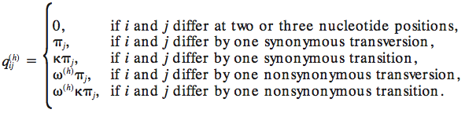

[](https://zenodo.org/badge/latestdoi/98828146)

# Codon Substitution Models

Models describing evolution at the codon level allow 
the estimation of measures of the selective forces 
acting on proteins 
([Kosiol et. al. 2000](https://academic.oup.com/mbe/article-abstract/24/7/1464/986344)). 

The available implementation is only M0 currently, 
also called as GY94, first published by 
[Goldman & Yang 1994](https://academic.oup.com/mbe/article-abstract/11/5/725/1008711), 
and late designated to be one of the M-series (M0-M13) proposed by 
[Yang et al. 2000](http://www.genetics.org/content/155/1/431.short).


The relative instantaneous substitution rate _q<sub>ij</sub>_ from codon _i_ to codon _j_ 
can be calculated as:


The above two figures are copied from [Yang et al. 2000](http://www.genetics.org/content/155/1/431.short).

## Tutorial

The tutorial is available in [wiki](https://github.com/BEAST2-Dev/codonmodels/wiki).

## XML example

The codon substitution model takes codon alignment as the input, 
where the codon alignment wraps the nucleotide alignment 
and has to use _codon_ data type, 
for example:

```xml
<data id="codon.alignment" data="@alignment" dataType="codon" 
      geneticCode="vertebrateMitochondrial" spec="CodonAlignment"/>
```

The attribute _geneticCode_ includes "universal", "vertebrateMitochondrial", 
"yeast", "moldProtozoanMitochondrial", "mycoplasma", "invertebrateMitochondrial", 
"ciliate", "echinodermMitochondrial", "euplotidNuclear", "bacterial", 
"alternativeYeast", "ascidianMitochondrial", "flatwormMitochondrial", 
"blepharismaNuclear", "noStops".

The xml to use __M0__ looks like:

```xml
<parameter id="m0.omega" value="0.04484"/>
<parameter id="m0.kappa" value="20.41545"/>

<input spec="codonmodels.M0Model" id="m0" verbose="true">
    <omega idref="m0.omega"/>
    <kappa idref="m0.kappa"/>
    <frequencies id="m0.freqs" spec="CodonFrequencies" pi="F3X4">
        <data idref="codon.alignment"/>
    </frequencies>
</input>
```

The type of equilibrium codon frequencies _π<sub>j</sub>_ consists of 
"equal", "F1X4", "F3X4", and "F60/F61" 
([Yang 2006](https://www.amazon.com/Computational-Molecular-Evolution-Oxford-Ecology/dp/0198567022/ref=ed_oe_p/102-1394520-6676140)). 
Setting `verbose="true"` will print the rate category matrix determining 
which formula to use to calculate _q<sub>ij</sub>_.

## Testing

The [codeml](http://abacus.gene.ucl.ac.uk/software/paml.html) results 
(available [here](./codeml)) are used to compare with
the tree likelihood from this package given the same input. 

The BEAST 2 xml to test tree likelihood is also available 
[here](./examples/testCodonLikelihood.xml).

Table 1: tree likelihood using M0 

| Frequencies  | Omega  | Kappa | Codeml  | BEAST 2 codon model |
| ------------- | ------------- | ------------- | ------------- | ------------- |
| equal  | 0.14593  | 10.69924  | -2098.864211  | -2098.8642114431645  |
| F1X4  | 0.10195  | 13.49811  | -2009.834314  | -2009.8343141884977  |
| F3X4  | 0.08000  | 15.34858  | -1960.766171  | -1960.7661713238033  |
| F60  | 0.08327  | 15.54039  | -1915.225157  | -1915.2251567137826  |

The small differences between two likelihoods are caused by rounding error. 
As you can see, their differences are slightly increased when the number of free parameters 
describing codon frequencies is increased.   

## Citation

Dong Xie. (2017, November 1). Codon substitution models v1.0.0. Zenodo. 
http://doi.org/10.5281/zenodo.1039992

## Note

This package is depending on BEAST 2.5.x, which will release on Match 2018.
