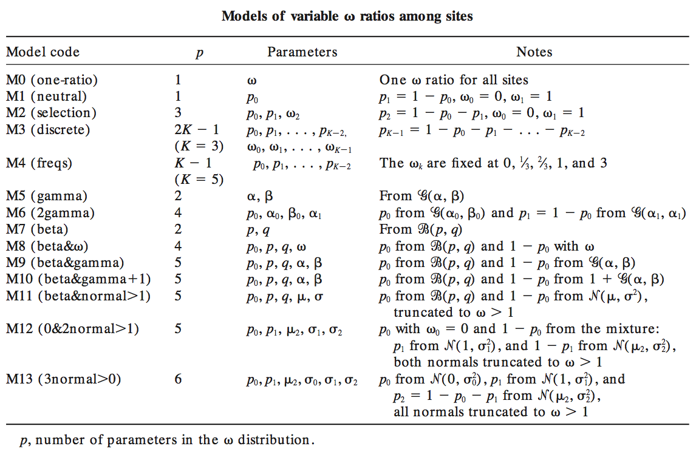
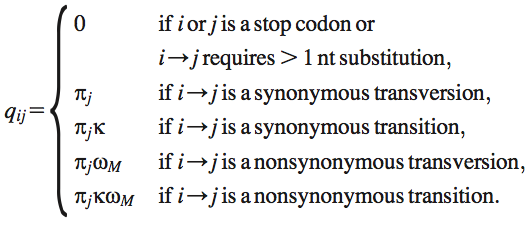

# Codon Models

Models describing evolution at the codon level allow 
the estimation of measures of the selective forces 
acting on proteins 
([Kosiol et. al. 2000](https://academic.oup.com/mbe/article-abstract/24/7/1464/986344)). 

The available implementation is only M0 currently, 
also called as GY94, first published by 
[Goldman & Yang 1994](https://academic.oup.com/mbe/article-abstract/11/5/725/1008711), 
and late designated to be one of the M-series (M0-M13) proposed by 
[Yang et al. 2000](http://www.genetics.org/content/155/1/431.short)



The relative instantaneous substitution rate _q<sub>ij</sub>_ from codon _i_ to codon _j_ 
can be calculated as:



## XML example

The codon substitution model takes codon alignment as the input, 
where the codon alignment wraps the nucleotide alignment 
and has to use _codon_ data type, 
for example:

```xml
<data id="codon.alignment" data="@alignment" dataType="codon" 
      geneticCode="vertebrateMitochondrial" spec="CodonAlignment"/>
```

The attribute _geneticCode_ includes "universal", "vertebrateMitochondrial", 
"yeast", "moldProtozoanMitochondrial", "mycoplasma", "invertebrateMitochondrial", 
"ciliate", "echinodermMitochondrial", "euplotidNuclear", "bacterial", 
"alternativeYeast", "ascidianMitochondrial", "flatwormMitochondrial", 
"blepharismaNuclear", "noStops".

The xml to use __M0__ looks like:

```xml
<parameter id="m0.omega" value="0.04484"/>
<parameter id="m0.kappa" value="20.41545"/>

<input spec="codonmodels.M0CodonModel" id="m0" verbose="true">
    <omega idref="m0.omega"/>
    <kappa idref="m0.kappa"/>
    <frequencies id="m0.freqs" spec="CodonFrequencies" pi="F3X4">
        <data idref="codon.alignment"/>
    </frequencies>
</input>
```

The type of equilibrium codon frequencies _π<sub>j</sub>_; consists of 
"equal", "F1X4", "F3X4", and "F6n" 
([Yang 2006](https://www.amazon.com/Computational-Molecular-Evolution-Oxford-Ecology/dp/0198567022/ref=ed_oe_p/102-1394520-6676140)). 
Setting `verbose="true"` will print the rate category matrix determining 
which formula to use to calculate _q<sub>ij</sub>_.

## Testing

The [codeml](http://abacus.gene.ucl.ac.uk/software/paml.html) results 
(available [here](./codeml)) are used to compare with
the tree likelihood from this package given the same input. 

The BEAST 2 xml to test tree likelihood is also available 
[here](./examples/testCodonLikelihood.xml).

Table: tree likelihood using M0 

| Frequencies  | Omega  | Kappa | Codeml  | BEAST 2 codon model |
| ------------- | ------------- | ------------- | ------------- | ------------- |
| equal  | 0.09921  | 12.79493  | -21859.555067  | -21859.555067828274  |
| F1X4  | 0.07105  | 15.30702  | -21200.265498  | -21200.265498185152  |
| F3X4  | 0.04484  | 20.41545  | -20523.690325  | -20523.6903268066  |
| F60  | 0.04625  | 25.28743  | -20141.869495  | -20141.896988667882  |
